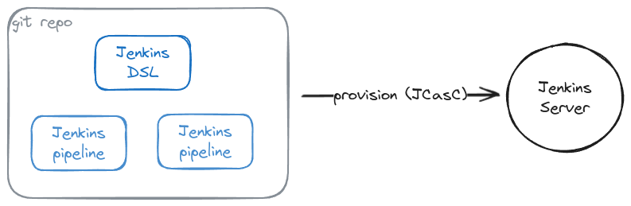

# Jenkins DSL Template Repository

    

This repository contains Jenkins DSL (Domain Specific Language) template.

## Jenkins DSL

Jenkins DSL is a Groovy-based DSL for writing Jenkins Pipelines. It provides a more structured and readable way to define Jenkins jobs.

## JCASC

JCASC is a plugin that allows you to manage your Jenkins configuration as code. It uses a YAML file to define your Jenkins configuration.
